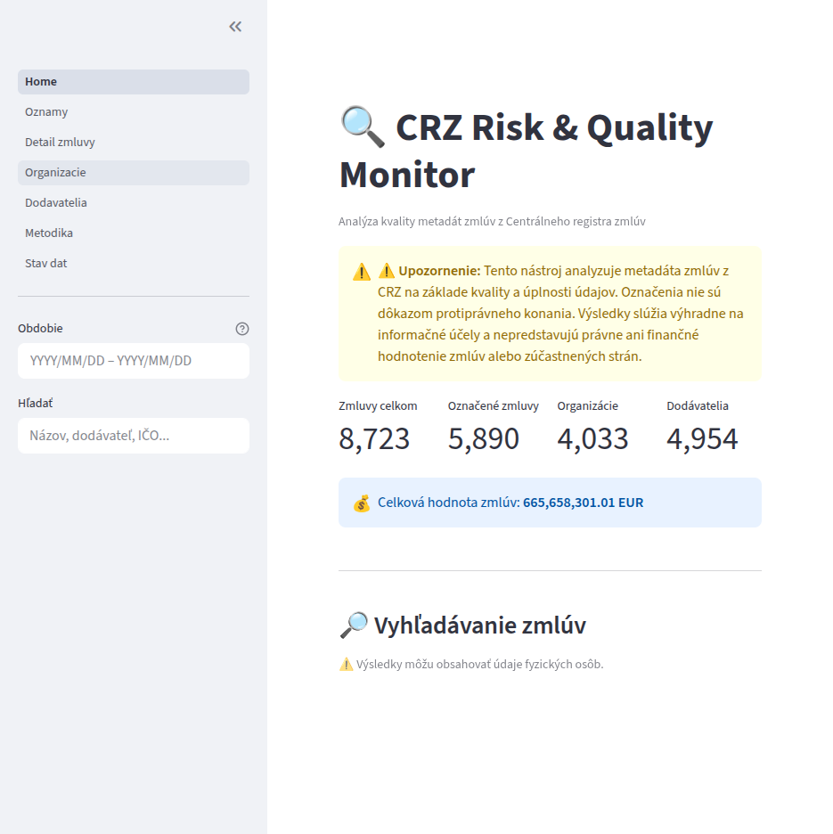
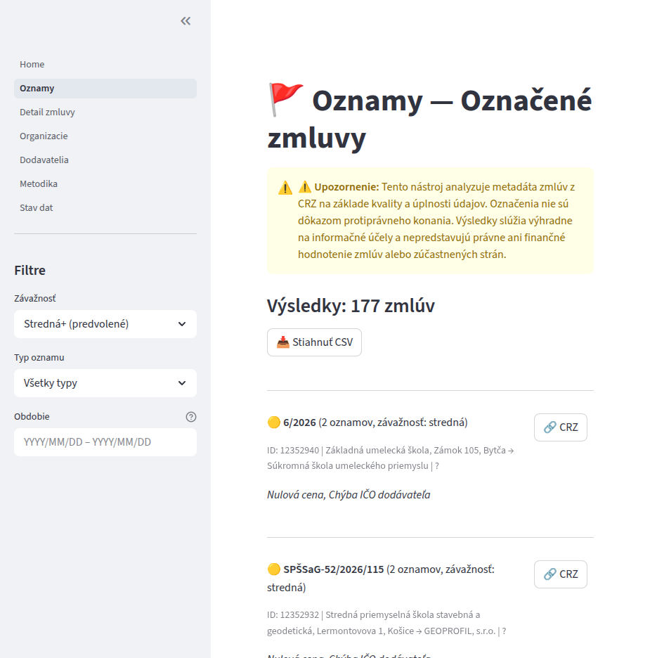
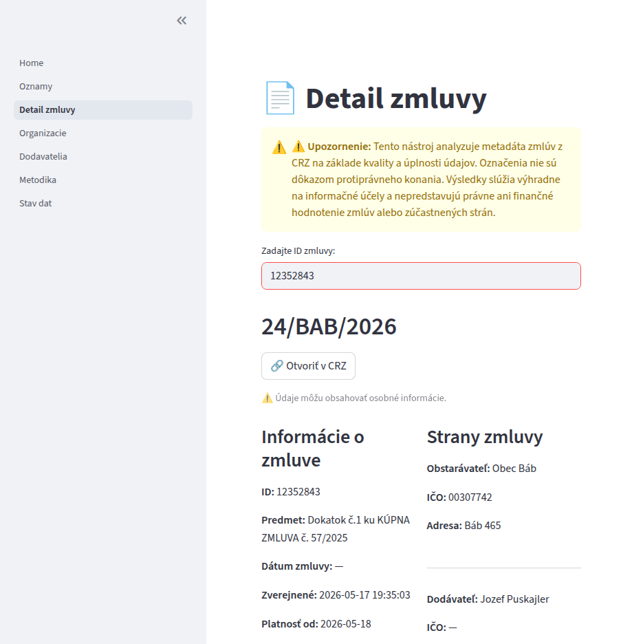
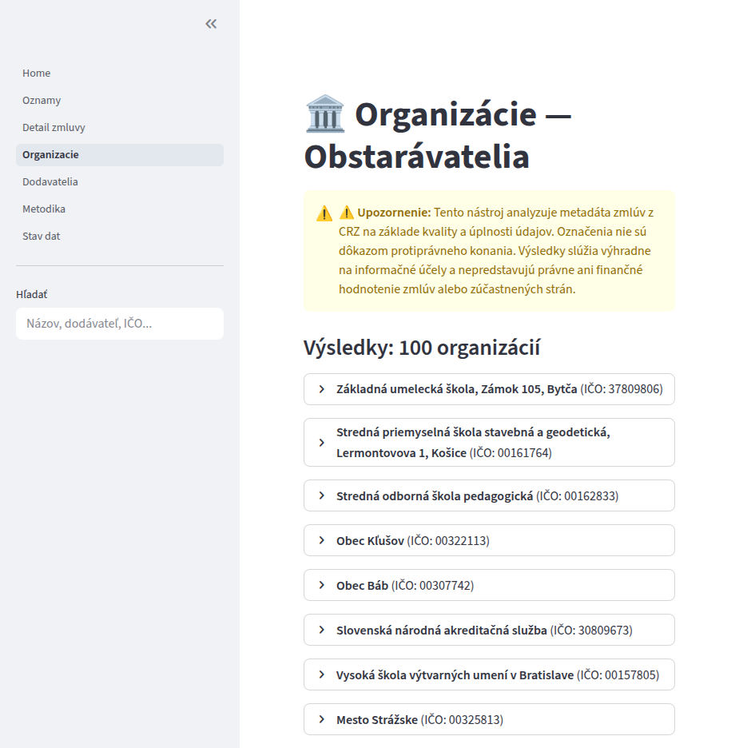
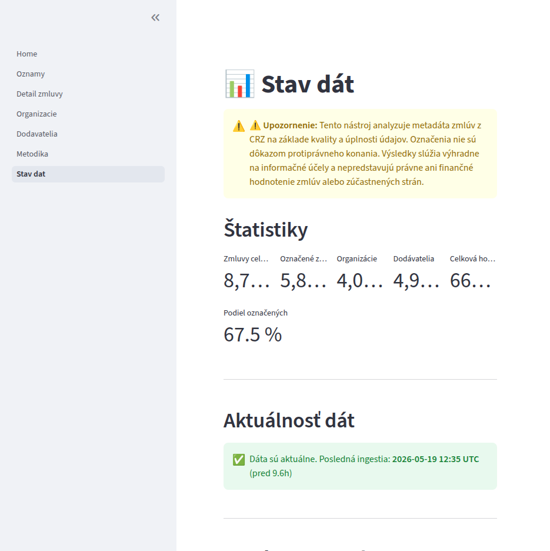

# CRZ Risk & Quality Monitor

**Metadata-quality and anomaly radar for Slovak public contracts.**

[](https://python.org)
[](https://postgresql.org)
[](./tests)
[](./tests)
[](https://docs.astral.sh/ruff/)
[](./LICENSE)

> **This tool identifies metadata quality issues, not procurement fraud.**
> Flags indicate incomplete data, not wrongdoing.

---

## The Problem

Slovakia's Central Register of Contracts ([CRZ](https://www.crz.gov.sk/)) publishes hundreds of thousands of public contracts. In theory, every taxpayer can inspect how public money is spent. In practice, the data is riddled with gaps:

- **~34.5%** of contracts have no price information at all
- **~23%** are missing the supplier's business ID (IČO)
- **~17.5%** are missing the buyer's IČO
- Many have zero-value prices, missing supplier names, or malformed identifiers

These gaps make it nearly impossible to aggregate spending by supplier, track contract patterns, or answer the basic question: *who got paid how much by whom?*

**CRZcheck** detects and surfaces these metadata quality issues so that analysts, journalists, and civic organizations know which contracts need manual review.

---

## What It Does

| Capability | Details |
|---|---|
| Automated ingestion | Downloads daily XML exports from the CRZ government API |
| 6 quality flags | Detects missing prices, zero prices, missing identifiers, invalid formats |
| Compound severity | Contracts with 3+ flags auto-escalate to "high" severity |
| Interactive dashboard | Streamlit app for browsing, filtering, and CSV export |
| Re-flagging lifecycle | Deterministic flags tied to ingestion run IDs — always consistent |
| Memory-efficient | Streaming XML parser handles 100+ MB files without loading into RAM |
| Data integrity | SHA-256 verification on every downloaded export |

### What It Does NOT Do

- No PDF analysis, OCR, or NLP on contract attachments
- No fraud detection — only structural metadata quality signals
- No cross-referencing with external registers (RPO, financial databases)
- No statistical normalization or anomaly scoring
- No real-time data — ingestion runs on a daily schedule

---

## Why This Project?

This is a **portfolio project** built to demonstrate end-to-end data engineering and analysis skills:

- **Data engineering** — ingestion pipeline with rate limiting, streaming XML parsing, upsert semantics, and idempotent re-processing
- **Data quality** — a systematic flag system with documented methodology and compound severity logic
- **Software engineering** — 383 tests, 98% coverage, clean lint, type-safe configuration, schema migrations, Docker setup
- **Domain expertise** — handles Slovak-specific data formats (European number formatting, IČO normalization, natural person heuristics)
- **Communication** — bilingual documentation (Slovak dashboard for users, English docs for technical audience)

I built it to solve a real problem: making Slovakia's public procurement data actually usable for analysis.

---

## Architecture

```
CRZ API ──► Downloader ──► XML Parser ──► Cleaning ──► PostgreSQL ──► Flag Engine ──► Dashboard
(httpx)      (rate-lim)    (iterparse)   (norm)      (SQLAlchemy)   (6 checkers)   (Streamlit)
```

| Component | Technology |
|---|---|
| Language | Python 3.12 |
| Database | PostgreSQL 16 (Docker) |
| ORM | SQLAlchemy 2.0 + Alembic |
| Dashboard | Streamlit |
| HTTP | httpx (rate-limited) |
| XML | lxml (streaming iterparse) |
| Config | Pydantic Settings |
| Testing | pytest (383 tests, 98% coverage) |
| Linting | Ruff |

For the full architecture with diagrams, data flow details, and database schema, see [docs/architecture.md](docs/architecture.md).

---

## Data Sources

All data comes from Slovakia's **Central Register of Contracts** (Centrálny register zmlúv):

- **Source:** [crz.gov.sk](https://www.crz.gov.sk/) — official government register
- **Format:** Daily ZIP archives containing XML files with contract metadata (34 fields per contract)
- **Volume:** Hundreds of thousands of contracts within a 90-day rolling window
- **Access:** Public REST API, no authentication required
- **Ingestion window:** 90 days (configurable via `CRZ_ROLLING_WINDOW_DAYS`)

For details on the CRZ data format and observed quality issues, see [docs/source-notes.md](docs/source-notes.md).

---

## Methodology — Quality Flags

The system applies **6 deterministic metadata quality checks** to every contract:

| Flag | Severity | Trigger |
|---|---|---|
| `MISSING_PRICE` | medium | No price data at all (~34.5% of contracts) |
| `ZERO_PRICE` | low | Explicitly stated price is 0 |
| `MISSING_SUPPLIER` | medium | Supplier name is absent |
| `MISSING_SUPPLIER_ICO` | medium | Supplier business ID is missing (~23%) |
| `INVALID_ICO_FORMAT` | low | Business ID is not 8 digits after normalization |
| `MISSING_BUYER_ICO` | medium | Buyer business ID is missing (~17.5%) |

**Compound severity:** 3+ flags on one contract → **high** severity (auto-escalation).

Flags are deterministic and fully re-computed on each ingestion run — no stale accumulation.

For full flag definitions, legitimate cases, and compound severity examples, see [docs/methodology.md](docs/methodology.md).

---

## Quick Start

### Prerequisites

- Python 3.12+
- Docker & Docker Compose
- Git

### Setup

```bash
# Clone the repository
git clone https://github.com/garadice/CRZcheck.git
cd CRZcheck

# Create virtual environment and install dependencies
python3 -m venv .venv
source .venv/bin/activate   # Windows: .venv\Scripts\activate
pip install -e ".[dev]"

# Configure environment
cp .env.example .env
# Edit .env — set DATABASE_URL if needed (defaults work with Docker setup)

# Start PostgreSQL
docker compose up -d

# Run database migrations
alembic upgrade head

# Ingest CRZ data (90 days — this takes several hours)
python -m app.ingestion.jobs

# Start the dashboard
streamlit run app/dashboard/Home.py --server.port 8501
```

### Using Make

```bash
make setup      # Create venv + install deps
make db-up      # Start PostgreSQL
make migrate    # Run migrations
make ingest     # Download + ingest CRZ data
make dashboard  # Start Streamlit on port 8501
make test       # Run tests
make lint       # Run ruff
```

### Verify

```bash
make test   # All 383 tests should pass
make lint   # Ruff should report no issues
```

---

## Demo

The dashboard is live at [crzcheck.bacimo.net](https://crzcheck.bacimo.net).

**Video walkthrough:**

https://github.com/garadice/CRZcheck/blob/main/docs/demo-video.webm

**Screenshots:**

| |
|---|
| **Home** — Overview with key metrics |
|  |
| **Oznamy** — Flagged contracts list |
|  |
| **Detail zmluvy** — Single contract view |
|  |
| **Organizácie** — Buyer organizations |
|  |
| **Stav dát** — Data health overview |
|  |

---

## Known Limitations

- **Metadata only** — no analysis of PDF contract text or attachments
- **No external cross-referencing** — flags don't validate against business registers or financial databases
- **Binary flags** — each flag is on/off; no weighted scoring or confidence levels
- **No version tracking** — flags don't account for historical changes to contracts
- **Slovak IČO only** — foreign identifiers may trigger false `INVALID_ICO_FORMAT` flags
- **Daily granularity** — no real-time data; ingestion runs on demand or scheduled daily
- **Natural person heuristic** — classification is approximate (based on absence of IČO and legal form suffix)

See [docs/limitations.md](docs/limitations.md) for the full analysis.

---

## Roadmap

- [x] Automated daily ingestion via cron
- [ ] Historical backfill beyond the 90-day window
- [ ] Statistical anomaly detection (price outliers, concentration metrics)
- [ ] Cross-referencing with the Slovak Register of Legal Entities (RPO)
- [ ] Dashboard English localization toggle
- [ ] Contract change tracking (amendment detection)
- [x] Public demo deployment — [crzcheck.bacimo.net](https://crzcheck.bacimo.net)

---

## Documentation

| Document | Description |
|---|---|
| [Architecture](docs/architecture.md) | Full architecture with diagrams, data flow, and schema |
| [Methodology](docs/methodology.md) | Flag definitions, severity rules, and re-flagging lifecycle |
| [Limitations](docs/limitations.md) | What this project doesn't do and why |
| [Source Data](docs/source-notes.md) | CRZ data format and quality observations |

---

## License

This project is licensed under the [MIT License](./LICENSE).
